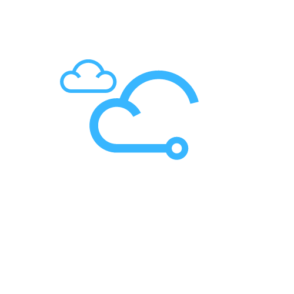

# Cloud-Byte ☁️🤖

## Overview

This project aims to develop a **Decentralized Cloud Storage System** using blockchain technology. The system allows users to securely store, share, and access files without relying on a central authority. By leveraging the principles of decentralization, the system ensures data **privacy**, **integrity**, and **availability**, distributing storage across multiple nodes.

## Features

- **User Registration**: Data owners must register to use the system.
- **File Upload**: Users can upload files, which are encrypted and distributed across the network.
- **Data Encryption**: Utilizes AES 256-bit encryption for file security.
- **Access Control**: Owners can grant or revoke access to shared files.
- **Data Integrity**: Hash values are generated and stored on the blockchain to ensure data integrity.

## Technical Architecture

### Components

1. **Blockchain Layer**
   - Stores metadata and hash values of files.
   - Ensures data integrity through consensus mechanisms.

2. **Storage Layer**
   - Utilizes IPFS (Interplanetary File System) for distributed file storage.
   - Files are fragmented and stored across multiple nodes.

3. **User Interface**
   - Web-based interface for user interactions.
   - Allows file uploads, access requests, and permission management.

### Workflow

1. **Registration**: Users register and create a wallet address.
2. **File Upload**:
   - User selects a file to upload.
   - The system checks storage availability.
   - File is encrypted and split into fragments.
   - Fragments are stored across multiple nodes using IPFS.
3. **Access Request**:
   - Users can request access to files.
   - Owners receive notifications and can approve or deny requests.

## Security Measures

- **Data Encryption**: All files are encrypted before being uploaded to ensure privacy.
- **Redundancy**: Data fragments are stored across several nodes to prevent data loss in case of node failure.
- **Access Control**: Only authorized users can access specific files based on permissions set by the owner.

## Future Enhancements

- **Adaptive Scheduling Mechanism**: Improve file retrieval times based on usage frequency.
- **Credit System**: Introduce a credit system to reward users based on their storage uptime and contributions.

## Conclusion

This decentralized cloud storage system aims to provide a secure, efficient, and user-controlled alternative to traditional cloud storage solutions. By utilizing blockchain technology, it addresses critical issues of privacy, security, and data integrity while promoting a collaborative storage ecosystem.
